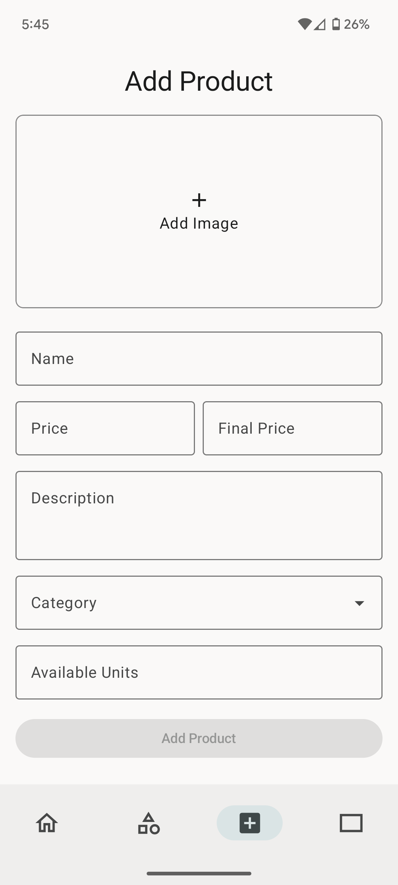

# 🛒 MyShopAdmin - Admin Control Panel for MyShop App

This is the **Admin Control App** for my main **MyShop** user app. It allows administrators to:

| Feature                 | Description                                                                 |
|-------------------------|-----------------------------------------------------------------------------|
| ➕ Add Content           | Add **categories**, **products**, and **banners**                          |
| 📊 Analytics            | View product sales data including revenue, best-selling products, etc.     |
| 📈 Visualizations       | See visual representation of orders per day and top-performing products    |
| 🧹 Simplicity Focused    | Avoids redundancy by not duplicating user app features                    |

> 🔁 I could have added features like "Get all products" or "Get all categories" just like in the main MyShop app, but that would be redundant. The goal here is to keep it simple and focused.

---

## 🧰 Tech Stack

| Technology        | Purpose                                  |
|------------------|------------------------------------------|
| MVVM             | Architectural Pattern                    |
| Jetpack Compose  | Declarative UI Toolkit                   |
| Dagger Hilt      | Dependency Injection                     |
| Kotlin           | Programming Language                     |
| Firebase         | Backend - Firestore, Storage             |
| ResultState      | Custom wrapper for external data results |

---

## 📊 Analytics Features

| Metric                     | Description                                       |
|---------------------------|---------------------------------------------------|
| Most Sold Category        | Category with highest quantity sold               |
| Most Profitable Category  | Category generating the highest revenue           |
| Top Products              | Based on both quantity and revenue                |
| Orders Per Day            | Daily trend of number of orders                   |
| Total Revenue             | Sum of all order values                           |
| Average Order Value       | Revenue per order                                 |

All analytics are displayed with clean visual charts.

---

## 📷 Screenshots

| Analytics Screen | Add Product Screen |
|------------------|--------------------|
|  |  |

---

## 📁 Project Structure Highlights

- `common/` folder contains:
    - 🔁 `ResultState.kt` – handles loading/success/error UI states
    - 🛠️ Constants
    - ⚙️ Dependency Injection modules

---

## 🚀 Summary

- Minimal and efficient Admin App
- Analytics driven insights
- Fully scalable architecture using best practices
- Ready for production with Firebase integration

---

MyShop App -> https://github.com/khushhal-mandal/myshop.git